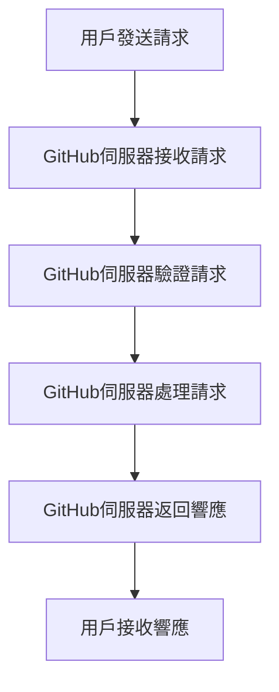

# GitHub App Flowchart

以下是GitHub應用程式的流程圖，描述了應用程式的各個步驟和流程。



## 流程步驟說明

### 1. 用戶發送請求
用戶通過應用程式發送請求到GitHub伺服器。

### 2. GitHub伺服器接收請求
GitHub伺服器接收到用戶的請求，並開始處理。

### 3. GitHub伺服器驗證請求
GitHub伺服器驗證請求的合法性和完整性。

### 4. GitHub伺服器處理請求
GitHub伺服器根據請求的內容進行相應的處理。

### 5. GitHub伺服器返回響應
GitHub伺服器處理完請求後，返回相應的響應給用戶。

### 6. 用戶接收響應
用戶接收到GitHub伺服器返回的響應，並進行相應的操作。

## 相關代碼引用

以下是與流程圖中各個步驟相關的代碼引用：

### 1. 用戶發送請求
```python
# 代碼示例
import requests

url = "https://api.github.com/repos/owner/repo/issues"
headers = {
    "Authorization": "token YOUR_ACCESS_TOKEN",
    "Accept": "application/vnd.github.v3+json"
}
data = {
    "title": "Found a bug",
    "body": "I'm having a problem with this."
}

response = requests.post(url, headers=headers, json=data)
print(response.json())
```

### 2. GitHub伺服器接收請求
```python
# 代碼示例
from flask import Flask, request

app = Flask(__name__)

@app.route('/webhook', methods=['POST'])
def webhook():
    data = request.json
    # 處理接收到的請求
    return "Received", 200
```

### 3. GitHub伺服器驗證請求
```python
# 代碼示例
import hmac
import hashlib

def verify_signature(payload, secret, signature):
    mac = hmac.new(secret.encode(), msg=payload, digestmod=hashlib.sha1)
    return hmac.compare_digest('sha1=' + mac.hexdigest(), signature)
```

### 4. GitHub伺服器處理請求
```python
# 代碼示例
def handle_request(data):
    # 根據請求的內容進行相應的處理
    if data['action'] == 'opened':
        # 處理打開的請求
        pass
    elif data['action'] == 'closed':
        # 處理關閉的請求
        pass
```

### 5. GitHub伺服器返回響應
```python
# 代碼示例
from flask import jsonify

@app.route('/webhook', methods=['POST'])
def webhook():
    data = request.json
    # 處理接收到的請求
    response = {
        "message": "Request received and processed"
    }
    return jsonify(response), 200
```

### 6. 用戶接收響應
```python
# 代碼示例
response = requests.post(url, headers=headers, json=data)
if response.status_code == 200:
    print("Request was successful")
else:
    print("Request failed")
```

## 示例和圖示

以下是一些示例和圖示，以幫助讀者更好地理解流程圖：

### 示例1：創建Issue
用戶通過應用程式創建一個Issue，GitHub伺服器接收並處理請求，最終返回創建成功的響應。

### 示例2：關閉Issue
用戶通過應用程式關閉一個Issue，GitHub伺服器接收並處理請求，最終返回關閉成功的響應。

### 圖示

```

STATUS: P1635 STEP-MADE
STATUS: P2216 STEP-MADE
STATUS: Pcc2c STEP-MADE
STATUS: P903a STEP-MADE
STATUS: Pda6f STEP-MADE

docs/github_app_flowchart.md
